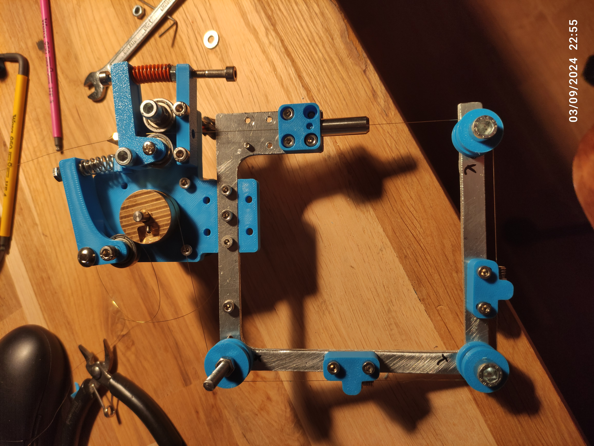
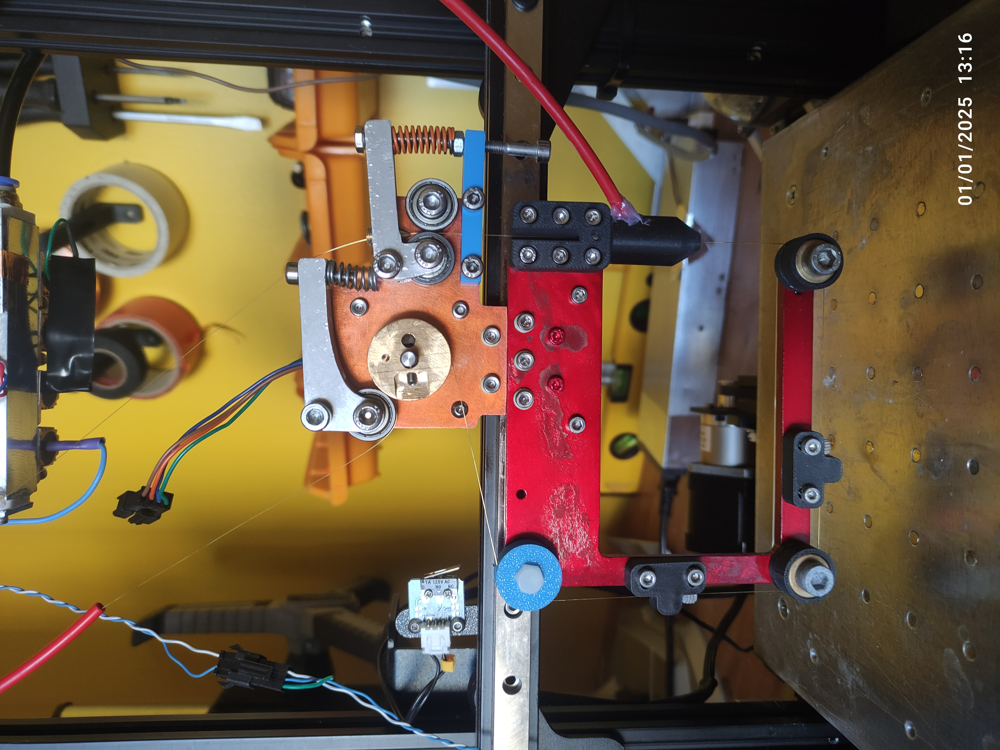

# WireEDM

Wire EDM uses electrical discharges to cut any conductive materials (brass, steel, aluminium even tungsten carbide) with no mechanical forces, enabling high precision, deep cuts, and machining of hard or delicate materials without deformation. 
This project demonstrates how to build a DIY wire EDM machine using salvaged components from an old 3D printer and other affordable parts, keeping the total cost around 150€ + the ender 3 and less than 30h of work.

The machine's frame and motion system leverage the hardware of the Ender 3,  with 1:51 gear reductions on the X and Y axes to enable extremely slow and precise movements required for EDM. 
A Raspberry Pi Pico clone with a TC4428 and a powerful MOSFET are used to switch up to 10A at 50KHz

This project includes guidance on generating toolpaths using a modified post processor from Fusion 360
Depending on the availability of tools and salvaged materials, replication costs may vary slightly. This project took me a few hundreds of hours of developpment but you should be able to replicate in less than 50h.

The conversion from a 3D printer to a wire EDM can be done in 6 steps:
- Mechanical modifications
- Wire feeder
- Firmware update (marlin)
- Ark generator
- Water loop
- Fusion 360 post processor

| Part | Quantity | Cost |
|- | - | - |
| Arduino uno + CNC shield + DRV8825  | 1 | 15€ |
| M3 * 10mm screws | 100 | 4€ |
| M3 * 8mm screws| 50 | 2€ |
| Linear rail MGN12H 300mm | 2 | 30€ |
| Nema 17 gearbox 1:51| 2 | 30€ |
| Total | a lot | 327€ |

# WARNiNG 
The voltage is lower than the SELV (50V for AC 120V for DC) in DRY CONDITIONS, for WET CONDITION the SELV is (25V for AC and 60 for DC). In addition there is no GFCI to protect you so disconnect the PSU everytime you're planning to touch a metalic component and wear at leat nitrile gloves. If you don't know precisely what you are doing just skip this project.

# Mecanical parts
## Motion

A big advantage of wire EDM compared to CNC milling is that the frame doesn't need to be very stiff, the hardware just need to support the wire feeder on the X axis and the water tank ~4kg on the Y axis. The Z axis isn't used during the cutting process but it's quite usefull to help changing the wire.

I've had a linear rail (MGN12H) on X and Y axis, it can be bolted directly on X axis with T nuts and for the why axis you need to drill 4 holes in the buildplate support thats all.
Wire EDM can be very slow depending on the thickness so one of the most important requirement is to be able to move slowly at a fixed rate. Regular stepper motors aren't able to do that, even with microstepping I made a fully printable belt reducer 1:64 but it need some improvements so I've just brought gearbox for nema 17 that can be directly connected to a 2GT pulley.

## Wire feeder

The wire feeder is the only complicated part which need to be custom made because it needs to fullfill a few requierments:
- Stifness, during the cutting process the arcs can generate vibrations, to achieve a good surface finish the wire need to be very straight
- Electrically insulated, even if the cutting is done under de-ionised water some electrolysis can occur which can reduce the power output. An insulated feeder also prevent from shorts if a metal part fall between the wire and the feeder
- Grounded, at 20kHz the long wire is a big antenna which can emit a lot of parasites and damage electronics. Grounding as much part as possible is crucial to avoid that (and any risk for pacemaker users)
- Tensionner mechanism, to avoid wire vibration the wire need to be adequatly tensionned.
- Waste spool, wire edm consume the workpiece AND the wire, depending on the material it can use a lot of wire
- Hard wire guide, I you have an old ender 3 you've probably experience filament grinding the extruder even if its plastic against plastic, the same thing can happend here with soft brass

This is the CAD of the first version, the extruder (nema 17 + a brass cylinder) is pulling the wire all the way from the tensionner. 
The tensionner conssit of two all bearing pressing into each other like a 3D printer extruder, the sping can b adjust to block more the wire and provide more tension.
Then, the wire need to be guided very precisely, for the upper guide I use a off the shelf rubis nozzle with a plastic nozzle around it for watercooling. The lower guide is a ceramic ball bearing with a PLA spacer and a .4mm brass nozzle to push the wire against the spacer. The two other ball bearings (ceramic for the lower one and steel with plastic cover for the upper one) just guie the wire to the extruder.

The ball bearings needs to be in ceramic for three reason:
1. Corosion
2. No lubricant can desovle in water
3. High hardness

The wire is connected to the (-) terminal of the PSU by the brass wheel, but since the wire emit EMF like an antenna, I want to ground as much metal as I can, so the whole motor assembly is at the same potential as the wire, but the frame of the printer and the red part are grounded. The voltage arent high so a layer of epoxy or an anodization is enougth to insulate the two regions.

The first version on the left use a lots of printed parts, it works but the tensionner some part can flex and reduce the wire tension/straightness so I made a second version in 5mm thick alluminium plate with 10mm thick tensionners.

All the parts are availlable in .sldprt and .step

# Electronics
## generator

It's actually pretty easy to make an arc for EDM, it won't be as powerfull as a commercial machine but pretty close. We just need to switch a powerfull MOSFET on and of very fast, I use the IRF135B203 wich can handle 135V 129A and 500A peak. The mosfet is drived by a TC4428 with a schotcky diode to protect the IC a square pwm signal is generated by the pi pico, the pico code is optimised to generate the wave as fast as possible.

During EDM process, the arc is vaporazing the metal we want to cut and also the wire, so the wire need to be replaced constantly. The easyest and cheapset way to do that is to use the extruder from the ender 3D with a custom aluminium mount as well as the driver from the motherboard. I've tried to modify the firmware to controll it independently but I didn't knew how, so I've cutted the traces on the motheroard and solder some wires between the driver and the pico.

## Power managment 

The power supply should be able to deliver at least 5A, 48V is enougth to cutt alluminium but a higher voltager means a higher energy stored in the capacitors (E = 1/2C U²). If you plan to cut copper or steel you can buy a switch mode power supply with adjustable output (mine can go up to 110V).

As soon as the arc is forming, the voltage decrease and the current increase, to protect the PSU, we need to limit the current with some power resistor, I have a 10ohm 100W resistor mounted on a waterblock to limit the current to 5A when the voltage is maximum.

Last part is the capacitors, it helps deliver high current durring short amount of time. You can't use some standard electrolitic capacitor (belive me I tried) ceramic or polymer are a good option, they don't care being shorted be they need to be cool in order to function properly, you can use the same waterblock as for the resistor.

# Toolpath generation

# Water

The EDM process must be done underwater for cooling and chip evacuation so the "builtplate" is a water tank, this one is in PVC but I will make it in acrylic in the future, I have printed and glued a grid at the bottom to attatch 2 flat brass block with tappered holes to fix the material I want to cut. The tank is held in place with magnets embeded in the orginal buildplate.
## Filtration

# Printed part list

Some more commun supply are also needed like heat shrink tube, solder, wires (I use wires from old RJ45 cable it can handle something like 5A without a problem, its free nd easly accessible).

A lots of tools are needed to work properly:

- Soldering iron
- Drill press
- Caliper
- Dial indicator
- Heat gun
- A good square rule
- Handed metal saw 
- Metal band saw (if your alumiun extrusions needed to be with a perfect 90° angle)
- Hand drill
- Center punch
- Marker for metal
- Hammer, clamps, screw drivers others hand tools
- 3D printer
- deburr tool

# Conception

